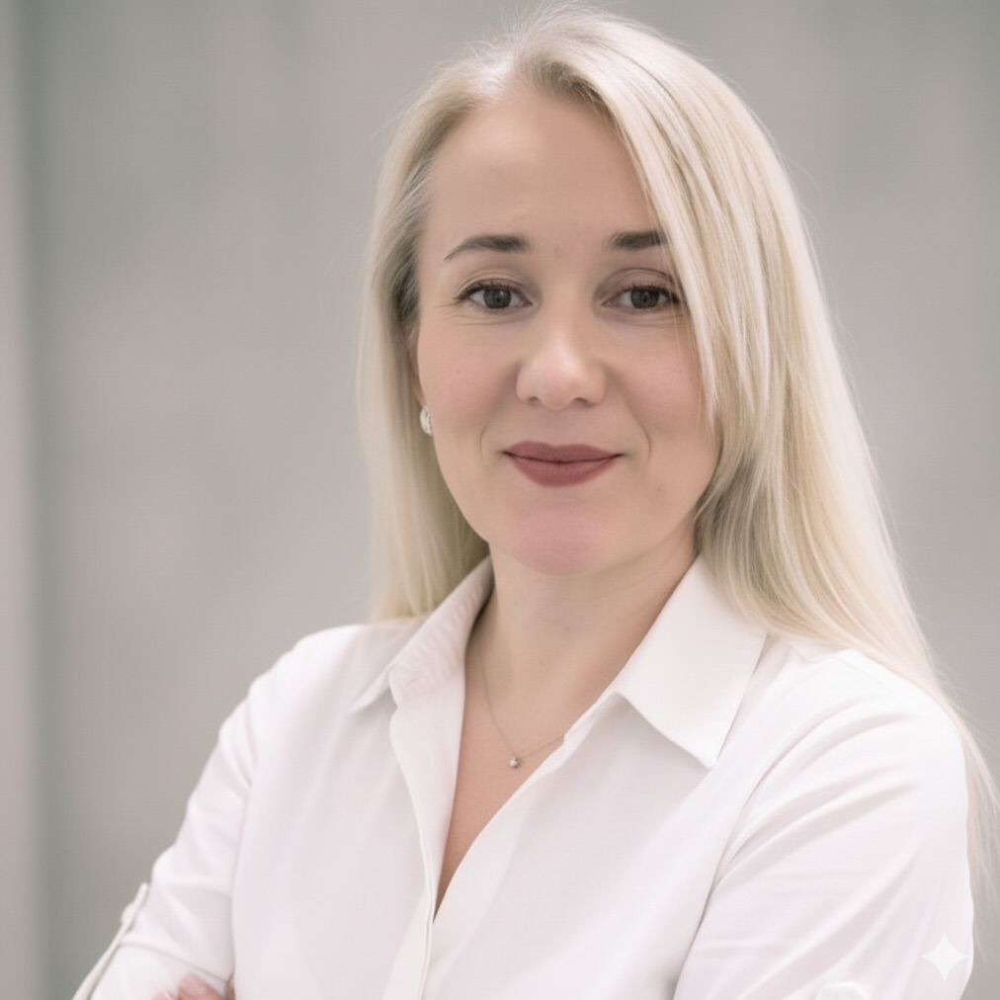

# Welcome to Tarnovski Consulting

Welcome to the official website of Tarnovski Consulting - your trusted Markit EDM Consultant.

## About Us

  
  

    
<strong>Vitali Tarnovski - Principal Consultant & Founder</strong>

    
Vitali is an expert in enterprise data management with deep specialization in Markit/S&P EDM. He has led consulting engagements for leading financial institutions including TD Securities, CPP Investment Board, Manulife, Ontario Teachers’ Pension Plan, and PSP Investments. 

    
Vitali has extensive experience designing and implementing security master solutions, integrating market data from providers such as Bloomberg, IBM, Morningstar, and S&P, and building custom EDM interfaces to improve usability and efficiency.

  

  
  

    
<strong>Tatiana Tarnovskaya - Head of Software Engineering & AI Innovation</strong>

    
Tatiana is a strategic and results-driven software engineering leader with extensive experience at Intuit, Nasdaq, and West Corp. She has led high-performing, globally distributed teams to deliver enterprise-scale software solutions, accelerating product growth and driving measurable business results. At Tarnovski Consulting, Tatiana focuses on AI-powered innovation, bringing expertise in large language models and platform engineering to create secure, efficient, and user-friendly applications.

  

## Core Services

- Markit EDM / S&P EDM Consulting
- Enterprise Data Management
- Security Master Design and Development
- Sourcing data from Bloomberg, IBM, Morningstar, S&P, and other feeds
- Markid EDM user interface implementation (Web UI)

## What We Offer

Our consulting services are designed to help businesses achieve their goals:

- **[Markit EDM Consulting](markit-edm-consulting.md)**: Complete implementation and optimization of Enterprise Data Manager
- **Strategic Planning**: Comprehensive business strategy development
- **Process Optimization**: Streamlining operations for maximum efficiency  
- **Business Analysis**: Data-driven insights for informed decisions
- **Project Management**: End-to-end project delivery excellence

[View our complete Markit EDM services](markit-edm-consulting.md)

## Why Choose Tarnovski Consulting?

Vitali has a proven experience delivering MarkitEDM solutions in TD Securities, CPP Investment Board, Manulife, Ontario Teachers Pension Plan, and PSP Investments.

## Get In Touch

Ready to take your business to the next level? Let's discuss how we can help.

- **[LinkedIn Profile](https://www.linkedin.com/in/vitalitarnovski/)**
- **Email**: Coming soon...
- **Phone**: Coming soon...

---

© 2025 Tarnovski Consulting. All rights reserved.

**Last Updated**: September 2025
